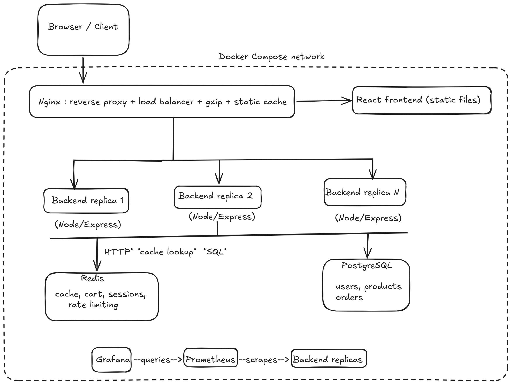
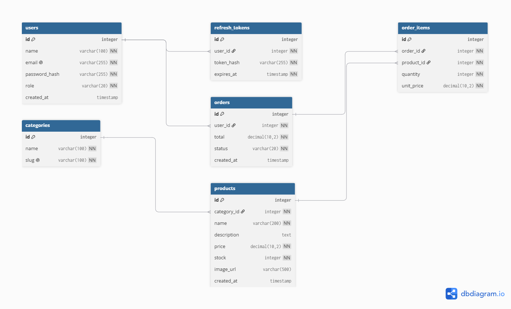

# Scalable E-Commerce Platform

A scalable e-commerce platform built with Redis caching and Dockerized
deployment, load tested to 10,000+ concurrent users.

> Work in progress: building day by day over 30 days.

## Architecture

## Database design

## Tech stack

React, Node.js/Express, PostgreSQL, Redis, Docker Compose, Nginx,
k6, Prometheus/Grafana, GitHub Actions